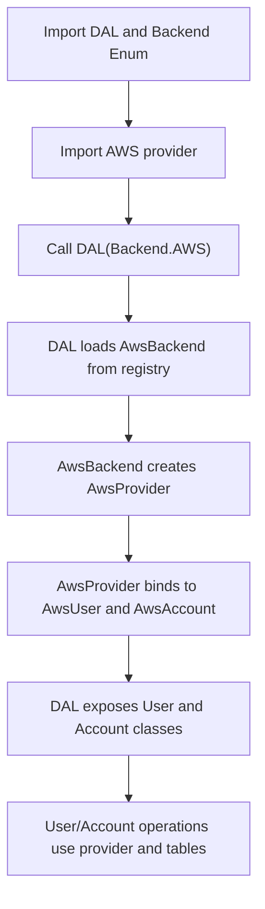

# The Data Abstraction Layer (DAL)

## About
The DAL here in `pycommon` is used to make it possible to easily swap in different back-end
database, blob storage, etc. so that core business logic remains unaffected.  We can imagine
a world in which one user of Amplify uses AWS + DynamoDB + S3 and another users chooses to
use Azure + CosmoDB + Azure Blob Storage. What we want is a simple switch (and a few
associated configuration items) to be swapped and the underlying application be capable
of running on either. 

We also want to make it easy so that a user can arbitrarily implement a new `provider` in the
DAL to support whatever technology stack they may wish to use. 

We note that the DAL is still in early development and is not currently implemented in all
of the backend Amplify code and, consequently, the mission stated above is not yet fully 
realized. Nevertheless, progress is being made in the `dal` directory of the `pycommon`
repository.

## The Wiring
The DAL's usage looks something like the following:

```python
from pycommon.dal import DAL, Backend
import pycommon.dal.providers.aws

dal = DAL(Backend.AWS)
```

And, provided some configuration is done (still in development), the system will utilize those
configuration items on that tech stack. 


### The moving pieces
In the `dal` directory we have a few key items.  
1. `dal.py` - 
2. `errors.py` - 
3. `contracts.py` - 
4. `providers/` - directory

#### dal.py
The `dal.py` file includes a few small functions which are necessary when building out a new provider
(note: A provider is an implementation of the abstract objects onto a concrete underlying system like AWS).
Within this file we have an Enum (`Backend`) that describes which Backends are availble to us. As new
providers are added, this can grow.

It includes a registry dictionary that we use to keep track of which Providers have been registered
to us and that are available to use. When a provider (such as when `aws` was imported in the above
example), it calls the `register_backend` function to add itself to the list. A quick peek at that inside
`/providers/aws/aws.py` we see:

```python
class AwsBackend(BackendABC):

    User = AwsUser
    Account = AwsAccount

    def __init__(self, **config: Any) -> None:
        # [...] Details omitted here for brevity

# Register at import time
register_backend(Backend.AWS, AwsBackend)
```

When we import aws, that register_backend gets called and the backend is added.

The DAL class also needs to add classes that are available to it when they're available. At the
time of this writing, we've only got two (User and Account) but a brief look at the DAL as
it exists right now will be instructive.

```python

class DAL:
    """
    Facade. After construction:
      d.User -> the provider's User class (subclass of UserABC)
      d.Account -> the provider's Account class (subclass of AccountABC)
    """

    def __init__(self, kind: Backend, **config: Any) -> None:
        try:
            backend_cls = _REGISTRY[kind]
        except KeyError as e:
            raise DalError(f"No backend registered for {kind}") from e
        self._backend: BackendABC = backend_cls(**config)

        self.User: Type[UserABC] = self._backend.User
        self.Account: Type[AccountABC] = self._backend.Account
```

We see the bottom two lines we declare that the DAL will expose a User (of type UserABC) and
Account (of type AccountABC) that we can use. **The DAL should not be considered complete and
usable until _ALL_ of the underlying data structures are available**.


#### errors.py
The `errors.py` file simply defines error objects which we use within the DAL.  These errors can be
used within helper functions (e.g., `pycommon/dal/providers/aws/helpers.py`). They're intended to
provide clear indicators of what failed.

#### contracts.py

The `contracts.py` file is where the abstract classes which must be subclassed are defined. So,
for example in the AWS provider we must extend all the classes (and their functionality) as defined
in the contracts.py.

Concretely - in contracts.py we define, for example, `UserABC`. This is our _abstract base class_ for
interacting with User data for the Amplify system. It has a number of fields which must be available
and a number of abstract methods which must be implemented (such as `save()`). 

It is important that the semantics of the objects are described in `contracts.py` (via docstrings) and
they MUST be honored in any provider implemented.  Why is this? It's because if a person implements a
new provider, they should be able to swap-in their own provider so long as they've implemented the
meaning and behavior of the functions as described in the contracts. After all, if one provider
implements `delete()` as disable, another implements it as simply deleting the record, and yet a
third implements it as a cascading delete - the system's behavior characteristics become non-deterministic.

The contracts.py also describes the `BackendABC` class which must be subclassed to create a new provider.
This will be discussed more in the next section. However I'll note here that when a Backend subclasses
`BackendABC`, it checks to make sure all of the required classes have also been subclassed.

#### Providers

Within the Backend objects we have a concept of a Provider. The provider is an object that is used
within other classes (e.g., `UserABC -> AwsUser`) to provide needed functionality. In the example of
the `AwsProvider`, at the time of this writing we have the following:

```python
from dataclasses import dataclass, field
from typing import Any


@dataclass
class AwsProvider:
    dynamodb: Any
    tables: dict = field(default_factory=dict)

    def get_table(self, name: str):
        if name not in self.tables:
            self.tables[name] = self.dynamodb.Table(name)
        return self.tables[name]
```

This is used in the `pycommon/dal/providers/aws/aws.py` file (which subclasses `BackendABC`) as follows.

```python
class AwsBackend(BackendABC):

    User = AwsUser
    Account = AwsAccount

    def __init__(self, **config: Any) -> None:
        boto3_kwargs: Dict[str, Any] = config.get("boto3_kwargs", {}) or {}

        dynamodb = boto3.resource("dynamodb", **boto3_kwargs)

        provider = AwsProvider(dynamodb=dynamodb)

        # Bind provider context to the AR classes
        self.User.provider = provider
        self.Account.provider = provider


# Register at import time
register_backend(Backend.AWS, AwsBackend)
```

We see that `provider` is an instance of `AwsProvider`. We pass it the dynamodb table it may need.
It then calls the `register_backend` functionality of the DAL. 

I should note that within the subclasses (e.g., `AwsUser`) the providers are Class Variables so
that they can be used as factory methods. 

```python
class AwsUser(UserABC):
    provider: ClassVar[AwsProvider]
```

